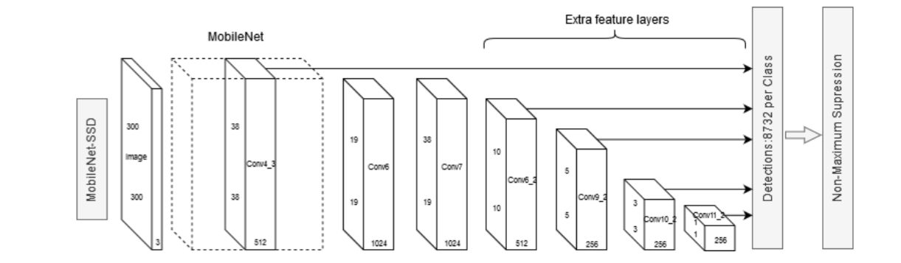
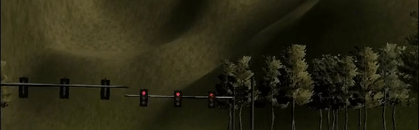

# Introduction
This is the project repo for the final project of the Udacity Self-Driving Car Nanodegree: Programming a Real Self-Driving Car. For more information about the project, see the project introduction [here](https://classroom.udacity.com/nanodegrees/nd013/parts/6047fe34-d93c-4f50-8336-b70ef10cb4b2/modules/e1a23b06-329a-4684-a717-ad476f0d8dff/lessons/462c933d-9f24-42d3-8bdc-a08a5fc866e4/concepts/5ab4b122-83e6-436d-850f-9f4d26627fd9).

<p align="left">
  
</p>

## The Team

| Role | Name | Responsibility  | E-mail |
| ----------- |-------------| -----| -----|
| Team Lead | [Paul Yeh](https://github.com/paulyehtw) | Implement classifier, waypoint updater | pyeh.tw@icloud.com |
| Team Member | [Kamiar Kordari](https://github.com/kamiarkordari) | Implement traffic light detector | kordari@gmail.com |
| Team Member | [Abhishek Patil](https://github.com/apatil5) | Implement Drive-by-Wire node | apatil5@mtu.edu |
| Team Member | [Varun Pradeep Duraisamy](https://github.com/d2911) | Code testing | varun2911pradeep@gmail.com |
| Team Member | [Xiaowen Liu](https://github.com/xiaowennn) | Code testing | lxiaowen@umich.edu |

---

# Project Overview
In project, ROS is used to implement core functionality of the autonomous vehicle system, including **traffic light detection, control, and waypoint following**! The code is tested using a simulator to be run on Carla real car.

The following is a system architecture diagram showing the ROS nodes and topics used in the project.
<p align="center">
  
</p>

Three main implementations for this project are : 
1. `tl_detector.py` and `tl_classifier.py` for perception
2. `waypoint_updater.py` for planning
3. `dbw_node.py` for control

### Perception
**Traffic Light Detector Node** is responsible for detecting traffic light's color and location.
For this to work, we need to first classify the color of traffic lights, **Single Shot Detector algorithm with MobileNet** is utilized.
The architecture is shown as below:
<p align="center">
  
</p>

With this [Object Detection Lab](https://github.com/udacity/CarND-Object-Detection-Lab), some pretrained models are available to detect objects. We use the images from simulator and rosbags recorded by Carla to test traffic light detection as below:
<p align="center">
  
</p>
<p align="center"><b>Simulator scene</b></p>


<p align="center">
  
</p>
<p align="center"><b>Carla rosbag</b></p>

As we can see, those pretrained models has many classes and not designed for this specific scenario, thus only red (sometimes yellow) light is detected.

However, [this repo](https://github.com/timothylimyl/Custom-Traffic-Light-State-Detector) has trained a traffic light detector with [COCO dataset](http://cocodataset.org/#explore) for this project, so it is good to use it for our project.

After we have the color of traffic light, we can associate the pose of traffic light with the closest waypoint then publish it.

### Planning
### Control


---
# Installation and running the code

Please use **one** of the two installation options, either native **or** docker installation.

### Native Installation

* Be sure that your workstation is running Ubuntu 16.04 Xenial Xerus or Ubuntu 14.04 Trusty Tahir. [Ubuntu downloads can be found here](https://www.ubuntu.com/download/desktop).
* If using a Virtual Machine to install Ubuntu, use the following configuration as minimum:
  * 2 CPU
  * 2 GB system memory
  * 25 GB of free hard drive space

  The Udacity provided virtual machine has ROS and Dataspeed DBW already installed, so you can skip the next two steps if you are using this.

* Follow these instructions to install ROS
  * [ROS Kinetic](http://wiki.ros.org/kinetic/Installation/Ubuntu) if you have Ubuntu 16.04.
  * [ROS Indigo](http://wiki.ros.org/indigo/Installation/Ubuntu) if you have Ubuntu 14.04.
* [Dataspeed DBW](https://bitbucket.org/DataspeedInc/dbw_mkz_ros)
  * Use this option to install the SDK on a workstation that already has ROS installed: [One Line SDK Install (binary)](https://bitbucket.org/DataspeedInc/dbw_mkz_ros/src/81e63fcc335d7b64139d7482017d6a97b405e250/ROS_SETUP.md?fileviewer=file-view-default)
* Download the [Udacity Simulator](https://github.com/udacity/CarND-Capstone/releases).

### Docker Installation
[Install Docker](https://docs.docker.com/engine/installation/)

Build the docker container
```bash
docker build . -t capstone
```

Run the docker file
```bash
docker run -p 4567:4567 -v $PWD:/capstone -v /tmp/log:/root/.ros/ --rm -it capstone
```

### Port Forwarding
To set up port forwarding, please refer to the "uWebSocketIO Starter Guide" found in the classroom (see Extended Kalman Filter Project lesson).

### Usage

1. Clone the project repository
```bash
git clone https://github.com/udacity/CarND-Capstone.git
```

2. Install python dependencies
```bash
cd CarND-Capstone
pip install -r requirements.txt
```
3. Make and run styx
```bash
cd ros
catkin_make
source devel/setup.sh
roslaunch launch/styx.launch
```
4. Run the simulator

### Real world testing
1. Download [training bag](https://s3-us-west-1.amazonaws.com/udacity-selfdrivingcar/traffic_light_bag_file.zip) that was recorded on the Udacity self-driving car.
2. Unzip the file
```bash
unzip traffic_light_bag_file.zip
```
3. Play the bag file
```bash
rosbag play -l traffic_light_bag_file/traffic_light_training.bag
```
4. Launch your project in site mode
```bash
cd CarND-Capstone/ros
roslaunch launch/site.launch
```
5. Confirm that traffic light detection works on real life images

### Other library/driver information
Outside of `requirements.txt`, here is information on other driver/library versions used in the simulator and Carla:

Specific to these libraries, the simulator grader and Carla use the following:

|        | Simulator | Carla  |
| :-----------: |:-------------:| :-----:|
| Nvidia driver | 384.130 | 384.130 |
| CUDA | 8.0.61 | 8.0.61 |
| cuDNN | 6.0.21 | 6.0.21 |
| TensorRT | N/A | N/A |
| OpenCV | 3.2.0-dev | 2.4.8 |
| OpenMP | N/A | N/A |

We are working on a fix to line up the OpenCV versions between the two.
